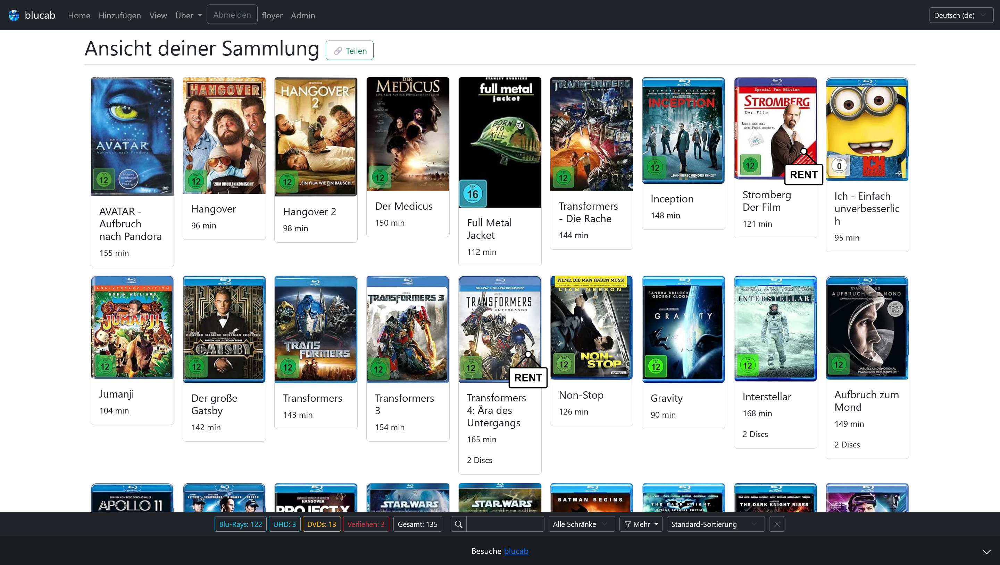
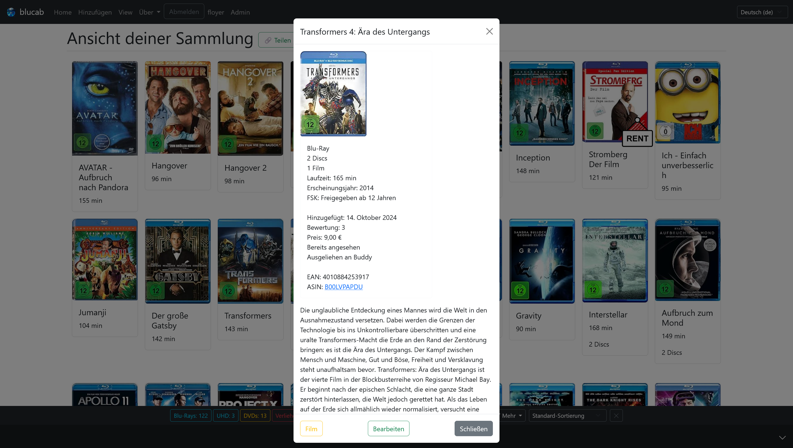

# blucab

English version and attributions below.

blucab ist eine Software zur Verwaltung deiner physischen Blu-Rays und DVDs als einfach zu bedienender Webservice, der auf dem Django-Framework basiert.

## Disclaimer

Dieses Projekt ist ein reines, nicht-kommerzielles Open-Source-Hobbyprojekt, das ich in meiner Freizeit nach der Arbeit entwickle.
Die Entwicklung kann unregelmäßig sein und "Breaking Changes" können ohne vorherige Ankündigung auftreten.
Solltest du das Projekt in einer produktiven Umgebung einsetzen, denke bitte an regelmäßige Backups.
Ich werde Releases erstellen, sobald ich das Projekt als einsatzbereit erachte.
Bitte nutze die Software so wie sie ist ("as is") und beachte die Lizenzvereinbarungen.
Die Entwicklung findet momentan direkt auf dem main-Branch statt. Dies wird sich nach dem ersten Release ändern.

Einige geplante Features sind im GitHub Issue-Tracker zu finden.

Allgemeiner Plan dieses Projekts:

- Eine Lösung zur Verwaltung deiner DVD- und Blu-Ray-Sammlung schaffen (in Zukunft auch Schallplatten? 🤔)
- Ein Ersatz für das eingestellte flickrack.com sein (Ich hoffe, du hast damals ein FlickRack .csv-Backup gemacht! 😉)
- Eines Tages stabil und selbst-hostbar sein (es gibt noch ungelöste Probleme)
  - Releases automatisch bauen und auf Docker-Hub o. Ä. pushen
  - Eine Website für alle hosten? (Finanzierung?, Rechtliche Aspekte bezüglich der Nutzerdaten?)
  - Ohne jegliche App nutzbar sein -> kompatibel mit Mobilgeräten
  - Django-basierte Tests integrieren

Das Projekt ist aktuell ausschließlich auf deutschsprachige Filminformationen ausgelegt.
Andere Sprachen erfordern weiteren Aufwand.
Die Identifikation der Disks erfolgt über die European Article Number (EAN).

## English Version

blucab is a software to manage your physical Blu-Rays and DVDs as a easy to use webservice based on the [Django](https://www.djangoproject.com/) Framework.

## Disclaimer

This project is a full open-source, non-commercial hobby project and developed in my spare time after work.
The development could be irregular and breaking changes could happen without further notice.
If you use the project in a productive environment, please consider backups.
I will create releases if I consider the project as ready to use.
Please use it as it is and check the license agreement.
Development is done on main-branch directly. This will change after the first release.

Some planned features are hidden within the GitHub Issue-Tracker.

General plan of this project:

- Create a solution to manage your DVD and Blu-Ray library (Vinyls as well in the future? 🤔)
- Be a replacement for the sunset flickrack.com (I hope you did a FlickRack .csv back then! 😉)
- Be stable and self-hostable at some point (there are unresolved issues)
  - Get releases build automatically and pushed to Docker-Hub or similar
  - Host a webpage for everyone? (Funding?, Legal aspects due to user-data?)
- Be usable without any App -> Mobile compatible
- Integrate django based tests

The project is based around Movie information in German only right now.
Other languages will require more work.
Disk identification is based on the European Article Number (EAN).


## Vorschau/Preview





## Usage (Not updated for a long time!)

This service is meant to be be self-hosted. To run it a docker-based and a manual way are available.

### Docker

The provided files in this project assume, that [docker](https://www.docker.com/) and [docker-compose](https://github.com/docker/compose) are installed on your system. The setup is different between Windows and Linux systems.
Please look for tutorials externally.<br><br>

The _docker-compose.yml_ file includes examples for persistent volume-folders to hold files for this project.
We recommend to add at least the database (if the default sqlite is used) and the downloaded covers.<br><br>

A environment-file _.env.dev_ can be derived from the _.env.dev.example_ and includes basic settings for the instance. Just copy it and rename it. The file is overwritten by the _docker-compose.yml_ file.

For a productive instance make sure:

- DEBUG is set to False
- SECRET_KEY is a long random unique string with at least 50 characters with a minimum of 5 unique ones

As mentioned in the example file the "DJANGO_SUPERUSER\_" variables are only needed for the initial setup of the database and can be removed from the _.env.dev_ after the first executions. Note this assumes your database is persistent.

Start the instance with<br>
`docker-compose up -d`<br>
to start it and let it run in the background.

### Manual

The Project requires Python 3 and the given packages in blucab/requirements.txt.<br>

```
cd blucab
pip install -r ./requirements.txt
```

Afterward a one-time migration and setup of the superuser needs to be done.
The first migration commands need execution after each update of this project.

```
python manage.py makemigrations
python manage.py migrate
python manage.py createcachetable

python manage.py createsuperuser
```

After installation you can run the service with your desired port.

```
python manage.py runserver 0.0.0.0:8000
```

## Attributions

- _Rent Vector Icon_ and _Vector New Icon_ by [Muhammad Khaleeq](https://www.vecteezy.com/members/iyikon/)
- Thanks for the nice Django Tutorial on YouTube by [Tech With Tim](https://www.youtube.com/@TechWithTim)
- Thanks to bhuma08 for the good overview about [Authentication using knox](https://dev.to/bhuma08/django-user-authentication-using-knox-5f17)
- Thanks to fraxel and Victor for the [picture trimming code](https://stackoverflow.com/a/10616717)
- AI (Gemini and ChatGPT) was used while development. It seems to be the new stackoverflow now. Every change is carefully reviewed by a human.
